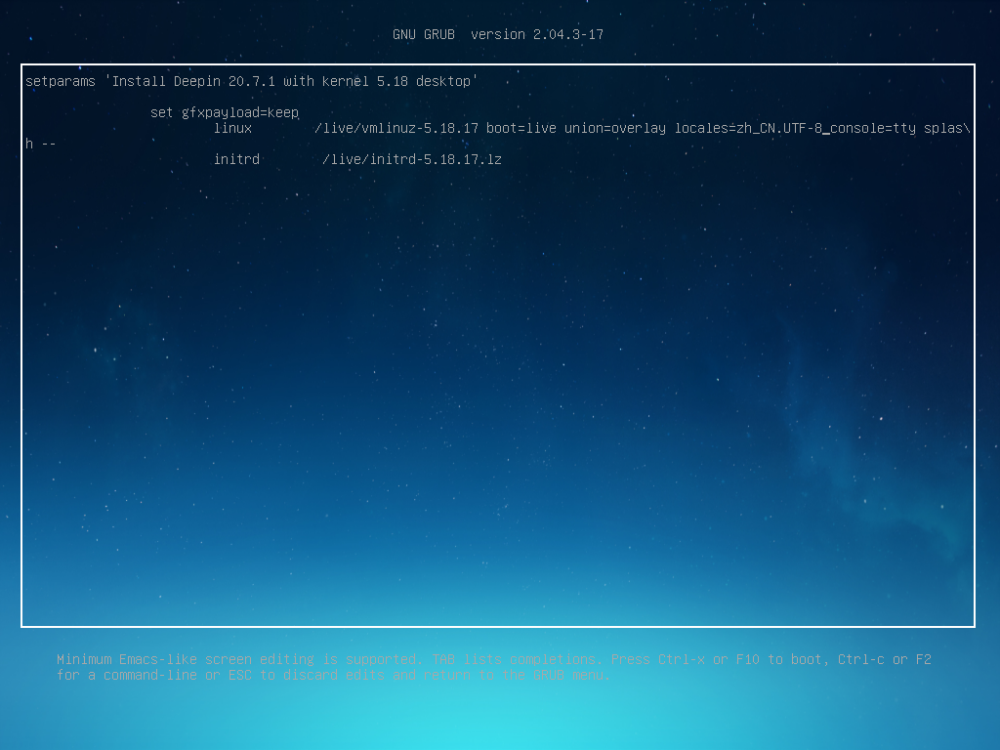
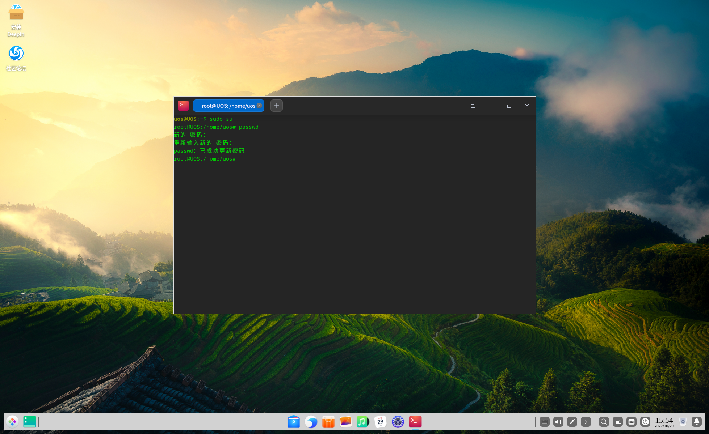
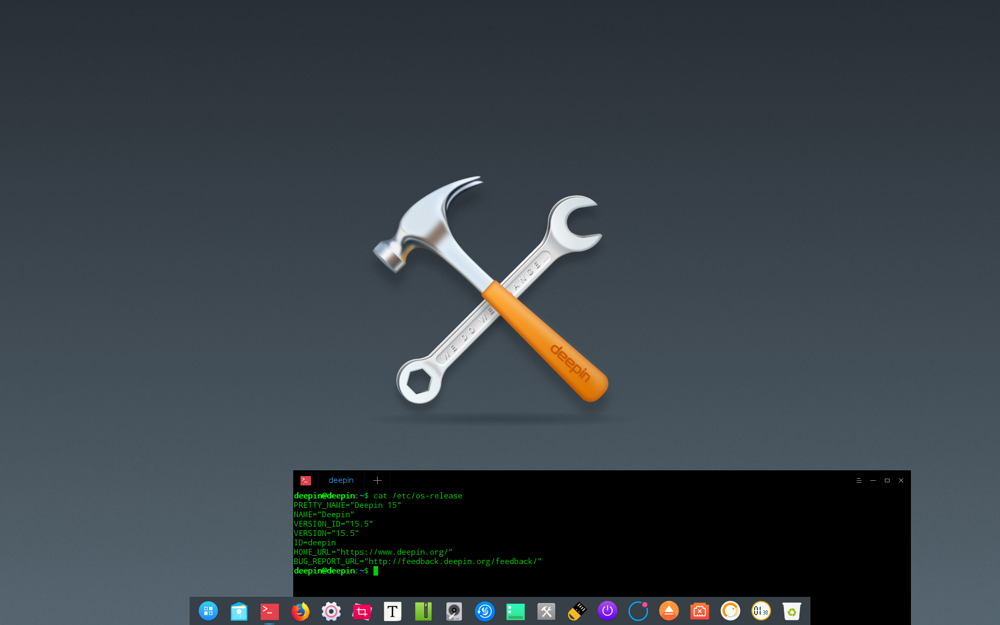
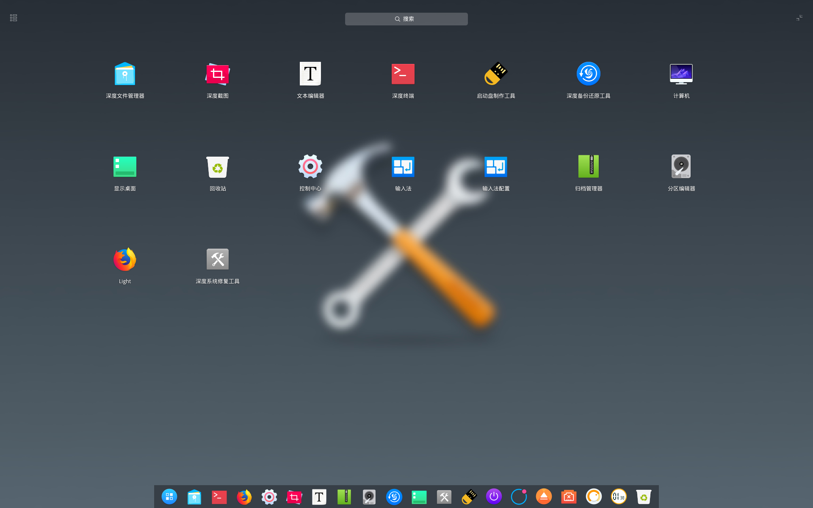
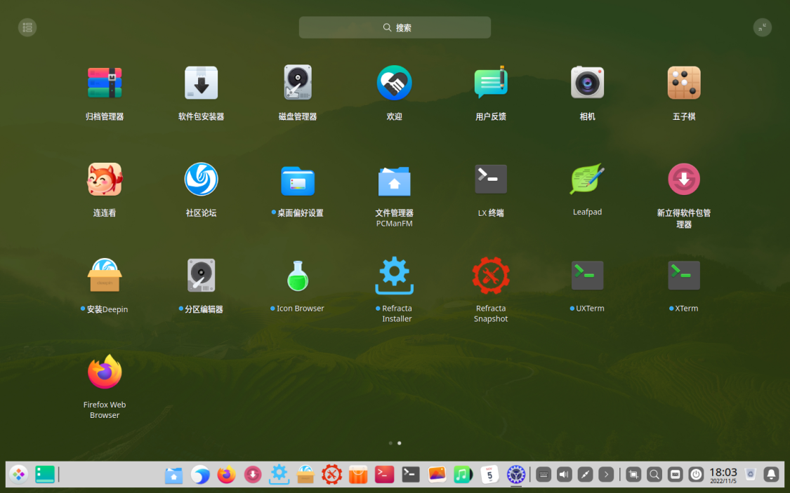
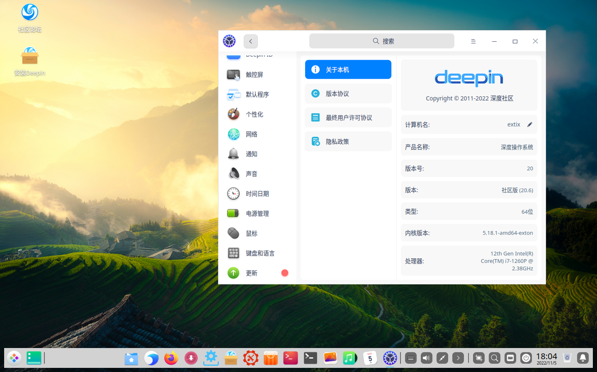

# 浅探 deepin Live 和修复 Linux 引导
> 本文的其他发布平台：[deepin Wiki](https://wiki.deepin.org/zh/04_%E6%8C%89%E5%90%AF%E5%8A%A8%E9%A1%BA%E5%BA%8F%E5%88%92%E5%88%86/00_%E7%B3%BB%E7%BB%9F%E5%90%AF%E5%8A%A8%E5%89%8D/01_%E5%90%AF%E5%8A%A8%E9%A1%B9%E7%9B%B8%E5%85%B3/%E6%B5%85%E6%8E%A2deepin-Live%E5%92%8C%E4%BF%AE%E5%A4%8DLinux%E5%BC%95%E5%AF%BC)、[语雀](https://www.yuque.com/pzm9012/ct5ume/ihc99w)
> （教程仅供参考，请以实际情况为准。）
本文是我综合网络上的几篇教程和自己不久前用 LiveCD 修复 UOS 引导的经历写成的，前半部分是对 deepin Live 的说明，后半部分是修复 Linux 引导的可能方法。
## 准备

你需要有一个存储空间足够大的、能被制作成启动盘的 U 盘或其他移动存储设备（推荐8 GB或更大，USB 3.0 或以上）。建议使用能多系统启动的 Ventoy ：在官网[下载 Ventoy](https://ventoy.net/cn/download.html)，解压后运行，安装 Ventoy 到 U 盘中（ U 盘**会被清空**，请提前迁移好其中的文件），再复制镜像进去（或者直接引导启动本地硬盘上的镜像文件）（详细介绍请阅读[文档](https://ventoy.net/cn/doc_news.html)）。制作后 U 盘存储文件的功能基本不受影响。如果是制作常规的（单系统）启动盘，可以使用[Rufus](http://rufus.ie/zh/)（仅 Windows 版）、[Etcher](https://www.balena.io/etcher/)等软件（下载不了？我转存了一份：[https://pan.hechuanyun.xyz/s/KzghL](https://pan.hechuanyun.xyz/s/KzghL) 或者 [https://cloud.189.cn/web/share?code=EbU3auiem2ue](https://cloud.189.cn/web/share?code=EbU3auiem2ue)（访问码：h4sf））。

拓展阅读：[deepin下用Ventoy装Windows](https://www.yuque.com/pzm9012/ct5ume/uf10gv)

Live 系统一般是用来体验或者修复本地 Linux 的，部分功能可能不正常，对闭源显卡驱动可能缺少支持，关机之后**数据不保留**（部分 Linux 支持使用 Persistence 保存数据以供下次使用，deepin 镜像无此功能）。使用 U 盘上的 Live 系统时，**关机之前切勿拔下 U 盘**。

本文只讲述 ISO 镜像形式的 Live 系统，安装到本地的 Live 的有关信息请阅读其他教程。

## 一  进入 deepin Live

### 1.1 通过 deepin 安装镜像进入 Live 

首先，制作一个 deepin 安装镜像的启动盘，然后重启电脑，按启动热键进启动菜单，选择从 U 盘启动。
UEFI 启动（现在的大部分电脑）：当任意一个“Install Deepin”高亮时（新电脑建议选择 kernel 内核版本较高的选项），按 e ，然后用方向键移动光标，删去`livecd-installer  `（也有人认为是删去“-installer ”），后面的代码改为 `locales=zh_CN.UTF-8` （s不要漏了，若一样则不用改），按 F10 进入。 
Legacy 启动：当任意一个“Install Deepin”高亮时，按 Tab 键，然后用方向键移动光标，删去 `livecd-installer `（也有人认为是删去“-installer ”） ，按 回车 进入。
笔者在使用20.7.1时，发现部分地方显示为英文。
修改 Live 用户密码：初始密码未知。打开终端，依次执行 2 条命令，再输入新密码（不回显）进行修改：

```sh
sudo su
passwd
```

但是有个问题：锁屏正确输入修改后的密码，却验证失败。所以如果使用系统时要离开一段时间，建议在控制中心的电源管理把关闭显示器和休眠改为从不。若不小心锁住了，按 Ctrl+Alt+F2 切换至 tty2 再执行 `startx` 进入桌面。然而这样会使语言显示出现异常。
通过这种不一样的启动方式，你可以在安装之前检查 deepin 对硬件的支持情况，再考虑是否安装。不过，这个的操作略显繁琐。

### 1.2 使用官方 Live 系统

[原版 Live 系统](https://cdimage.deepin.com/live-system/deepin-live-system-2.0-amd64.iso)内置了深度系统修复工具、深度备份还原工具等软件，其他功能有所精简，不能用于安装，主要用途就是维护电脑系统。它的发布时间还是2018年，因此可能在有些新电脑上**不能正常使用**。密码同样是未知的，可以自己改。


### 1.3 使用 gfdgd xi 的第三方 deepin LiveCD

推荐。基于 deepin 最近版本制作，内置了一些实用工具，deepin 的老大都认为 “可以作为社区项目参与到官方建设中”（见[https://bbs.deepin.org/post/236521](https://bbs.deepin.org/post/236521)的回复） 。
可以在[ gfdgd xi 的主页](https://bbs.deepin.org/user/239113)找到 Community Live CD 的发布帖子。他的作品又有多个版本，我只提醒一下：少数电脑在使用 full 版时貌似会出现缺失驱动的问题，如果原版 deepin 中有这些驱动，那么可以换用 install 版。

### 1.4 使用 ExTix Deepin 镜像的 Live 

[ExTix Linux](https://www.extix.se/) 有多个版本（[下载地址](https://sourceforge.net/projects/extix/files/)），其中 ExTix Deepin 基于 deepin，其镜像基于 deepin 的特定版本加以修改，比如[这个 22.6 版本](https://www.extix.se/extix-deepin-22-6-live-based-on-deepin-20-6-latest-with-refracta-snapshot-and-kernel-5-18-1-amd64-exton-build-220610/)使用 deepin 20.6。支持直接进入 Live。Live 的默认用户是live，密码是live；root 用户密码是root。
修改语言为简体中文（以 UEFI 为例）：在启动菜单里按向下键选择 `Other language (Press e to edit)`，按 e ，然后用方向键移动光标，更改文本为 `locales=zh_CN.UTF-8 keyboard-layouts=us`（后面这个参数我猜的，应该没错），按 F10 进入。Legacy 启动请分别改为按向下键、Tab 和回车键。





---

或者你也可以用其他 Linux 的 Live 系统，比如常见的 Ubuntu 及其衍生版、Manjaro、Veket 等，很多都能选择中文进入，并内置了输入法、Office 等软件。需要提醒的是，使用时不要产生太多数据以致系统盘占满；使用 Veket 前请阅读其说明；部分 Ubuntu 衍生版预装的 LibreOffice 无中文语言包，请执行 `sudo apt install libreoffice-l10n-zh-cn` 来安装它；Ubuntu 默认密码为无，Manjaro 默认密码为manjaro。

## 二  用 Live 修复 Linux 引导

> **注意：本节内容缺少足够的实践检验。** 
这里的方法适用于安装 Windows 后 Linux 引导被覆盖或类似情况。
如果是 UEFI 启动，理论上可以先在 BIOS 启动顺序中找一下有没有 deepin/UOS 的启动项，如果有就把它调到第一个。

### 2.1 使用工具

如果是修复 deepin 引导，可以用深度系统修复工具（官方 Live、Community LiveCD 中内置，deepin V15/V20 中用命令 `sudo apt install deepin-repair-tools` 安装）。打开它，选择“引导修复”，点击“开始修复”。注意：由于该工具一直未更新，不保证修复有效；不适用于 UOS。
使用boot repair、Pardus Boot Repair：略，boot repair 见参考资料 4。

### 2.2 手动修复

进入 Linux Live，打开终端，执行 `lsblk -f` 找到系统所在分区（一般是 ext4、btrfs、xfs 等文件系统，反正不是 NTFS），记下它的 sdaX 信息（例如 sda3，不同情况有所差别）。如果 Linux 引导在被覆盖之前完好，依次执行：（记得替换 sdaX）

```sh
sudo mount /dev/sdaX /mnt
sudo grub-install --root-directory=/mnt /dev/sda
```

对于支持 UEFI 启动但仍在使用 Legacy 启动的电脑，将最后一条命令替换为

```sh
sudo grub-install --root-directory=/mnt /dev/sda --target=i386-pc
```

在显示“安装完成”后重启，一般情况下 Linux 引导菜单就会显示出来，选择 Linux 启动后再在终端执行 

```sh
sudo update-grub
```

更新引导以添加新安装的 Windows 的选项。
但如果 Linux 引导异常，你可以回到 Live 中，尝试依次执行以下命令修复：（第 2 条 sdaY 为 EFI 分区，Legacy 启动忽略）

```sh
sudo mount /dev/sdaX /mnt
sudo mount /dev/sdaY /mnt/boot/efi
sudo mount --bind /dev /mnt/dev
sudo mount --bind /proc /mnt/proc
sudo mount --bind /sys /mnt/sys
sudo chroot /mnt
grub-install /dev/sda
update-grub
```

最后一条命令可以替换为下面这个，在部分 Live 中只能用这个：

```sh
grub-mkconfig /boot/grub/grub.cfg
```

运行完毕后重启试试看。如果还是不行，抱歉，我只能帮你到这里了。操作过程中有错误信息的话可以搜索一下，寻找解决方法。
如果此前 Grub 引导的延时设置成了 0，那么你可能需要打开文件管理器，找到系统分区，打开其中的 /etc/default/grub 文件，编辑 `GRUB_TIMEOUT=0` 为其他数值。
最后的解决方案是在硬盘上别的地方再安装一个 Linux ，用它建立的引导来引导。或者在 Live 中备份重要文件后重装系统。

## 三  参考资料

1. deepin折腾笔记：[https://bbs.deepin.org/zh/post/191781](https://bbs.deepin.org/zh/post/191781)
2. 用ventoy运行deepin不用安装到硬盘的方法：[https://bbs.deepin.org/zh/post/223203](https://bbs.deepin.org/zh/post/223203)
3. 多项启动 — Linux Mint Installation Guide：[https://linuxmint-installation-guide.readthedocs.io/zh_CN/latest/multiboot.html](https://linuxmint-installation-guide.readthedocs.io/zh_CN/latest/multiboot.html)
4. 【解决问题】Error:failed to get canonical path of /cow： [https://blog.csdn.net/weixin_44436677/article/details/107133417](https://blog.csdn.net/weixin_44436677/article/details/107133417)
5. 系统 | 把 Grub 安装到 U 盘上 / 重建 Grub 引导：[https://zhuanlan.zhihu.com/p/139474313](https://zhuanlan.zhihu.com/p/139474313)

由于笔者水平有限，本文可能存在一些疏漏之处。如果你认为本文存在需要改进之处，欢迎指出。
